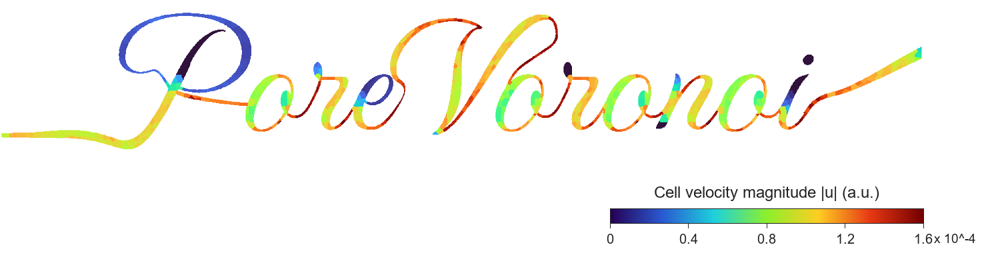
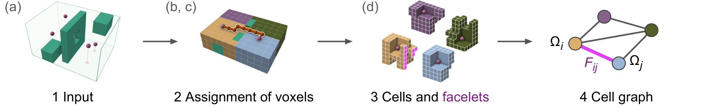
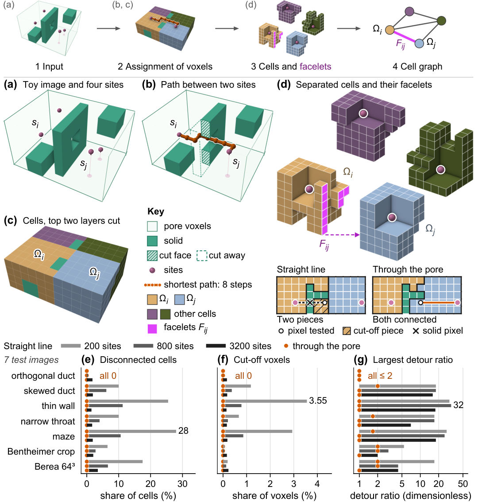

# PoreVoronoi-FV

<p align="center">
  
</p>

<p align="left">
  <a href="https://github.com/LinqiZhu/PoreVoronoi_FV"></a>
  
  
  
  
  
</p>

**Finite-volume Stokes flow on pore-space cells built around tracked-particle positions, with interface fluxes that balance every cell.**

Particle tracking velocimetry (PTV) in pore-flow images gives the fluid velocity only where particles pass.
PoreVoronoi-FV puts one finite-volume cell around each pore voxel that holds a tracked particle position (a *site*),
assigns every other pore voxel to the site it reaches in the fewest steps through the pore, and solves steady Stokes
flow on these cells. Measured or sampled particle velocities can be added to the same calculation as data.

<p align="center">
  
</p>
<p align="center"><em>The four steps: (1) a pore–solid image and the sites; (2) every pore voxel is assigned to the site reached in the fewest steps through the pore; (3) a site with its voxels is a cell, and two cells meet on facelets (shared voxel faces); (4) the cell graph, one node per cell and one line per neighbour pair. The letters above the steps refer to the panels of manuscript Figure 1, shown under <a href="#method-in-one-figure">Method in one figure</a>.</em></p>

> **Manuscript:** Zhu, L., Wang, C., Gu, Y., Blunt, M. J., Bultreys, T., & Wen, G. (2026). *PoreVoronoi-FV: Conservative pore-scale flow on cells fixed by tracked particles.* Manuscript.
>
> **Evidence archive:** result records not in this repository are in the evidence archive supplied with the manuscript; until the article is published it is available from the corresponding author (linqi.zhu@imperial.ac.uk) on request.
>
> **This repository:** the code, our own numerical data and two small segmented rock images (a Bentheimer crop and a Berea block) behind the manuscript; no experimental flow data.

### What it does

- **Cells around given sites, each in one piece.** Every pore voxel goes to the site reached in the fewest face-to-face steps through the pore; equal distances go to the site with the smaller position number in the voxel array. Every cell is then one connected piece of pore space. On the seven test images of the manuscript (200, 800 and 3200 sites each, spread over the pore by farthest-point sampling: each new site is the pore voxel farthest, through the pore, from the sites already chosen), straight-line assignment splits up to 28% of the cells into pieces; through-the-pore assignment splits none (Figure 1).
- **Exact ownership on GPUs.** Ownership is this assignment of every pore voxel to a site. ROI–JFA, named after the region of interest (the voxels left open) and the jump flooding algorithm that makes the proposal, computes it exactly: a free-space proposal, a certification step that proves most proposals right, and a closure that recomputes only the voxels left open. It returns the same owners and distances as full breadth-first search (BFS), which grows all cells outward from the sites one layer of voxels at a time. It was 1.37–2.88 times faster than persistent-frontier BFS (the GPU advances the layers itself) on one NVIDIA H200 GPU in all 21 timed cases (Figure 3), and 7.35–13.42 times faster than host-driven BFS (the CPU starts each layer) on a laptop GPU on the five Berea site sets of Table 2.
- **Stokes flow in which every cell balances.** One pressure per cell and one velocity profile (trace) per interface patch (a group of facelets between the same two cells that touch edge to edge and share a normal), shared by the two cells, so every facelet flux leaves one cell and enters the other. On the six controlled cases (five synthetic 24 × 24 × 64 ducts and a 16 × 96 × 96 Bentheimer sandstone crop, each with a reference flow we computed on its voxel grid; see [Data](#data)), the largest cell mass residual of the Stokes-only calculation, which uses no particle velocities, is 1.9 × 10⁻¹⁶ ν/h² (Table 5). In the assisted calculation, particle velocities (records: one particle's position and velocity in one frame) enter as a weighted misfit on the same cells, and the cells still balance. With noise-free velocities sampled from the reference flow at the default weight, the error on voxels without a record falls by 8–39% (Table 6).

---

## Table of contents

- [Quick start (about 5 minutes on one CPU core)](#quick-start-about-5-minutes-on-one-cpu-core)
- [Method in one figure](#method-in-one-figure)
- [Installation](#installation)
- [Data](#data)
- [Python API](#python-api)
  - [Your own image and particle positions](#your-own-image-and-particle-positions)
- [Reproducing the paper](#reproducing-the-paper)
- [Repository structure](#repository-structure)
- [Implementation notes](#implementation-notes)
- [Troubleshooting](#troubleshooting)
- [Citation](#citation)
- [License](#license)

---

## Quick start (about 5 minutes on one CPU core)

The quick start needs Python with NumPy and SciPy only; no GPU. The commands are for bash; for Windows shells see the note under [Installation](#installation).

```bash
# 1. Get the code and a CPU environment
git clone https://github.com/LinqiZhu/PoreVoronoi_FV.git
cd PoreVoronoi_FV
python -m venv .venv
source .venv/bin/activate              # Windows: .venv\Scripts\activate
python -m pip install numpy==2.2.6 scipy==1.15.3

# 2. Checks of the CPU package (no flow solve)
python -B porevoronoi_fv/check_selectors_and_assembly.py

# 3. Every Table 5 value from the stored solutions (no flow solve)
python -B porevoronoi_fv/check_archived_solutions.py

# 4. One Stokes-only solve: the orthogonal duct (case c1) on the cells of its particle tracks
python -B examples/quickstart.py
```

What each step does:

| Step | Command | What it checks |
|---|---|---|
| 2 | `python -B porevoronoi_fv/check_selectors_and_assembly.py` | The record selector (the rule that keeps, in each cell, the particle record nearest the cell centroid) on all six controlled cases; check G1 (the vectorised assembly equals the loop assembly of `hybrid_voronoi_trace.py`) on a tiny periodic instance, including two perturbations that must fail it; the identity of the Stokes-only operator with the forward assembly. The last line reads `check_selectors_and_assembly pass True` when everything passes. |
| 3 | `python -B porevoronoi_fv/check_archived_solutions.py` | For each case c1–c6: L1, every Table 5 value recomputed from the stored solution (`data/controlled_cases/<case>/stokes_only_solution.npz`) equals the printed value; L2, the rebuilt cells equal the stored ones (counts, cell volumes, facelet velocities and fluxes, bit for bit); L3, every record velocity equals the reference velocity of its voxel. One line per case with `L1`, `L2`, `L3` set to `True` when the check passes. |
| 4 | `python -B examples/quickstart.py` | Rebuilds case c1 from its particle window, solves the Stokes-only calculation with the paper's settings of MINRES (the minimal-residual method), and prints the cell count, the largest cell imbalance and the errors next to the values printed in Table 5. The cell count and the errors are marked PASS or FAIL against the printed digits; the largest imbalance is a round-off value, so the mass balance is checked through the mass backward error instead (the largest cell imbalance over the largest unsigned flux through one cell; Supporting Information, Equation (S11)). The last line counts the checks that pass. |

```text
$ python -B porevoronoi_fv/check_selectors_and_assembly.py        (last lines)
c6 {'A': {'pass_': True, 'cells': 6739, 'distinct': 837, 'unique_cells': 183, 'matching': 837, 'defect': 2.6645352591003757e-15}, 'B': {'pass_': True, 'cells': 836, 'distinct': 836, 'unique_cells': 836, 'matching': 836, 'defect': 1.3322676295501878e-15}}
check_selectors_and_assembly pass True
```

```text
$ python -B porevoronoi_fv/check_archived_solutions.py        (first and last of the six lines)
c1 {'L1': True, 'L2': True, 'L3': True, 'L1_min_sig': 14.974268368089971, 'printed': {'N_c': ('4937', '4937'), 'eK_arch_s': ('-4.19', '-4.19'), 'eK_flux_s': ('-4.19', '-4.19'), 'e_phi': ('4.33', '4.33'), 'e_u_cell': ('3.89', '3.89'), 'r_inf_m': ('1.14e-16', '1.14e-16')}, 'seconds': 3.57705792831257}
c6 {'L1': True, 'L2': True, 'L3': True, 'L1_min_sig': 15.146163928400544, 'printed': {'N_c': ('6739', '6739'), 'eK_arch_s': ('8.99', '8.99'), 'eK_flux_s': ('9.95', '9.95'), 'e_phi': ('12.98', '12.98'), 'e_u_cell': ('12.65', '12.65'), 'r_inf_m': ('5.75e-18', '5.75e-18')}, 'seconds': 4.272792055271566}
```

```text
$ python -B examples/quickstart.py        (summary)
Stokes-only calculation, case c1: computed values against Table 5 of the paper
(printed values from data/controlled_cases/expected/printed_table_values.json unless noted;
 PASS = the computed value, rounded to the printed number of decimals, equals the printed string)
  quantity                                   computed        printed  check
  cells N_c                                      4937           4937  PASS
  trace unknowns N_Z                           142443         142443  PASS printed: run record
  MINRES iterations                              7125           7066       printed: archived run (run record); not checked
  MINRES relative KKT residual               3.94e-14     <= 1.0e-12  PASS info == 0 and residual <= max(20 rtol, 1e-12)
  r_inf^mass = max_i |(D z)_i|/V_i           1.41e-16       1.14e-16       round-off: reported, not checked
  eta_m (mass backward error)                5.02e-16       <= 1e-14  PASS
  e_u,cell (%)                                 3.8930           3.89  PASS
  e_phi (%)                                    4.3320           4.33  PASS
  e_K,flux^s (%), signed                      -4.1854          -4.19  PASS
  e_K,stored^s (%), signed                    -4.1854          -4.19  PASS
8 of 8 checks pass; total 91.0 s
```

These outputs come from a fresh copy of this repository run on one core of an Intel Xeon 6960P (Linux, Python 3.12.11, NumPy 2.2.6 and SciPy 1.15.3 installed with the `pip` command of step 1): `check_selectors_and_assembly.py` 58 s, `check_archived_solutions.py` 23 s for all six cases, `quickstart.py` 92 s, and `quickstart.py --assisted` 148 s with 14 of 14 checks passing (the error on the pore voxels without a record falls from 4.53% for the Stokes-only calculation to 2.76% with one record per cell). The tests of `tests/` pass on a CPU node; the three GPU tests are skipped there.

The printed values of case c1 (orthogonal duct, Table 5) are: N_c = 4937 cells, N_system = 147 379 unknowns, signed permeability errors e<sup>s</sup><sub>K,stored</sub> = −4.19% and e<sup>s</sup><sub>K,flux</sub> = −4.19%, interface-flux error e<sub>φ</sub> = 4.33%, cell-mean velocity error e<sub>u,cell</sub> = 3.89%, largest mass residual 1.1 × 10⁻¹⁶ ν/h².

Run times in our records, single BLAS thread: `check_selectors_and_assembly.py` under one minute and `check_archived_solutions.py` 3.0–4.2 s per case on a Windows laptop (Python 3.12.10, NumPy 2.4.6, SciPy 1.17.1); the c1 Stokes-only calculation that `quickstart.py` repeats took 106.3 s from sites to solution, 102.7 s of it in MINRES (7125 iterations to a relative residual of 3.9 × 10⁻¹⁴), on one core of an Intel Xeon Platinum 8470 (Python 3.10.20, NumPy 2.2.6, SciPy 1.15.3). The three scripts write JSON reports under `outputs/`. More options of the quick start (other cases, the assisted calculation): [`examples/README.md`](examples/README.md).

---

## Method in one figure

<p align="center">
  
</p>
<p align="center"><em>Manuscript Figure 1. Through-the-pore assignment splits no cell; straight-line assignment splits up to 28% of cells.</em></p>

**Top row and panels (a)–(d), the construction.** The input is a binary image (each voxel pore or solid) and the sites, the pore voxels that hold a tracked particle position. Each pore voxel is owned by the site reached in the fewest face-to-face steps through the pore (b); a tie goes to the site with the smaller position number in the voxel array, ordered z, then y, then x. A site with its voxels is a cell (c). Two cells meet on facelets, the voxel faces they share (d); facelets that touch edge to edge and have the same normal form an interface patch. The cell graph has one node per cell and one line per pair of neighbouring cells.

**Panels (e)–(g), why the distance is measured through the pore.** On seven test images (five ducts and two sandstone crops), each with 200, 800 and 3200 farthest-point sites, straight-line (Euclidean) assignment splits up to 28% of the cells into more than one piece, cuts up to 3.55% of the pore voxels off from their own site, and gives detour ratios (path length through the pore to the site over the shortest grid path ignoring the solid) up to 32. Through-the-pore assignment splits no cell, cuts off no voxel and keeps the largest detour ratio between 1 and 2.

**On these cells.** The unknowns are one pressure per cell and one trace per interface patch: a constant velocity plus one linear mode for each in-plane direction in which the patch is spread out (the connected-P1 basis). Each cell recovers a velocity and a velocity gradient from the traces on its boundary by the divergence theorem. Its viscous energy is 2ν V<sub>i</sub> ε : ε of the recovered strain rate plus a penalty, of weight τ (default 1) times 2νA/h per facelet, on the gap between each facelet trace and the cell's affine velocity field. The facelet flux is one number shared by the two cells, so the balance operator D holds the net outflow of every cell, and the saddle-point system

```text
[ A    D_rᵀ ] [ z   ]   [ b ]
[ D_r  0    ] [ p_r ] = [ 0 ]
```

(one balance row removed to fix the pressure constant) gives traces whose facelet fluxes balance every cell to solver tolerance. Here p<sub>r</sub> is the Lagrange multiplier of the remaining balance rows, not the pressure. Padding p<sub>r</sub> with a zero in the removed row gives p, and the cell pressure is p<sub>h</sub> = −p, up to a constant (manuscript Eq. (19)). The fluxes are conservative; velocity fields recovered from them inside the cells are not exactly so (manuscript Section 4.5).

---

## Installation

Commands are written for bash (Linux, macOS, or Git Bash on Windows). In Windows PowerShell or cmd, save each `python - <<'PY'` … `PY` block as a `.py` file and run it with `python -B file.py`, and use `.venv\Scripts\activate` instead of `source .venv/bin/activate`. Windows PowerShell 5.1 has no `&&`: run the two commands on separate lines or join them with `;`.

### 1. Create an environment

The flow solver (`porevoronoi_fv/`) uses only NumPy and SciPy and runs on the CPU. Use Python 3.10 or 3.12, the versions of the two recorded environments that ran it:

| Runs | Python | NumPy | SciPy | Machine |
|---|---|---|---|---|
| Stokes-only solves of the six controlled cases (cluster CPU node, one thread) | 3.10.20 | 2.2.6 | 1.15.3 | Linux cluster node, Intel Xeon Platinum 8470 |
| Checks `check_selectors_and_assembly.py` and `check_archived_solutions.py` | 3.12.10 | 2.4.6 | 1.17.1 | Windows laptop, one thread |

```bash
python -m venv .venv
source .venv/bin/activate              # Windows: .venv\Scripts\activate
python -m pip install numpy==2.2.6 scipy==1.15.3
```

These two pins, the versions of the cluster runs, install on Python 3.10 and 3.12 and are all that `porevoronoi_fv/` needs. The pinned files in `environment/` hold the laptop versions instead (NumPy 2.4.6, SciPy 1.17.1, pandas 3.0.5), which need Python 3.11 or later. Pinned files and the five recorded environments: [`environment/ENVIRONMENT.md`](environment/ENVIRONMENT.md).

### 2. Optional packages

| Needed for | Package |
|---|---|
| GPU ownership code (`gpu/ownership/`) and the GPU forward path (`gpu/`) | CuPy built for your CUDA version, for example `python -m pip install cupy-cuda12x`; the recorded timing runs used CuPy 14.1.1 |
| Manufactured-solution scripts (`reproduce/shared/manufactured_stokes.py` and the scripts that import it) | SymPy |
| Table and figure scripts in `reproduce/` | pandas, Matplotlib |
| All `reproduce/` table and figure scripts at the recorded laptop versions | `python -m pip install -r environment/requirements.txt` (Python 3.11 or later; the laptop ran Python 3.12.10) |
| Unit tests of the GPU pipeline in `tests/` | pytest (the tests that need CuPy are skipped without it) |

### 3. Verify the environment

```bash
python - <<'PY'
import sys, numpy, scipy
print("Python:", sys.version.split()[0])
print("NumPy: ", numpy.__version__)
print("SciPy: ", scipy.__version__)
try:
    import cupy
    print("CuPy:  ", cupy.__version__, "| GPUs:", cupy.cuda.runtime.getDeviceCount())
except Exception as exc:
    print("CuPy:   not available (needed only for the GPU code):", type(exc).__name__)
PY
```

### 4. Verify the files

`SHA256SUMS.txt` lists the SHA-256 of every file of the repository, and the case loader refuses a reference flow or particle window whose SHA-256 differs from its run record. To check a clone, run from the repository root:

```bash
sha256sum -c --quiet SHA256SUMS.txt && echo "all files match"
```

Without `sha256sum` (for example in Windows PowerShell), the same check in Python:

```bash
python - <<'PY'
import hashlib, pathlib

bad = n = 0
for line in pathlib.Path("SHA256SUMS.txt").read_text(encoding="utf-8").splitlines():
    digest, path = line.split(maxsplit=1)
    path, n = pathlib.Path(path.lstrip("*")), n + 1
    if not path.is_file() or hashlib.sha256(path.read_bytes()).hexdigest() != digest:
        bad += 1
        print("MISMATCH", path)
print(f"{n - bad} of {n} files match")
PY
```

Every listed file should match.

---

## Data

The repository carries our own numerical data (synthetic controlled cases, the reference flows we computed on them, simulated particle windows in which particles are carried through those flows, stored solver solutions and result records) and two small segmented rock images used as test geometries: the 16 × 96 × 96 Bentheimer crop and a 64³ block of the public Berea image. No experimental flow data are included: no measured particle tracks, and no images or segmentations of the drainage or glass-filter experiments or of the sand-pack data set. Every particle window in this repository is simulated in our reference flows. Data terms: [`DATA_LICENSE.md`](DATA_LICENSE.md). File-by-file description: [`docs/DATA.md`](docs/DATA.md).

All flow quantities are in solver units: voxel edge h = 1, kinematic viscosity ν = 1, uniform body force f = (0.002, 0, 0) ν²/h³ along x, periodic in x with walls in y and z. Arrays are indexed (z, y, x), x varying fastest.

### Included

The six controlled cases have one folder each in `data/controlled_cases/`: `orthogonal_duct` (c1), `skewed_duct` (c2), `thin_wall` (c3), `narrow_throat` (c4), `maze` (c5) and `bentheimer_crop` (c6). In the table, `<case>` stands for one of these folders.

| Path | What it is | Format and keys |
|---|---|---|
| `data/controlled_cases/<case>/reference_flow.npz` | Reference Stokes flow of the six controlled cases on the image's own voxel grid, computed by us. c1–c5: synthetic 24 × 24 × 64 ducts (orthogonal duct, skewed duct, thin wall, narrow throat, maze); c6: the Bentheimer crop | `.npz`: `mask` (bool), `labels` (int32, pore-voxel number in raster order), `U` (pore voxels × 3), `p`, `phi` (voxel-face fluxes), `owner`, `neigh`, `area`, `avec`, `face_centroid`, `dvec`, `tproj` (per voxel face), `twall`, `volume`, `centroid`, `div` (per pore voxel), `K_eff_x` (stored permeability), `metadata` (JSON string), `case` |
| `data/controlled_cases/<case>/particle_tracks.csv.gz` | Simulated particle windows: one particle per 51.1 pore voxels, started at random pore voxels (seed 20260711), carried for 100 frames through the reference flow, one Euler step per frame with the velocity of its voxel, stopped at walls. Each record is a noise-free sample of the reference flow | gzip CSV with columns `frame_id`, `frame_absolute_time_s`, `frame_pv`, `particle_id`, `batch_id`, `x_unwrapped_voxel`, `x_mod_voxel`, `y_voxel`, `z_voxel`, `ux_dns_frame_interp`, `uy_dns_frame_interp`, `uz_dns_frame_interp`, `p_dns_frame_interp`, `track_interp_alpha`, `track_status_before`, `track_status_after`; positions in voxel units, voxel centres at integer coordinates |
| `data/controlled_cases/<case>/particle_tracks_generator.json` | Settings and counts of the window generator for that case | JSON |
| `data/controlled_cases/<case>/stokes_only_solution.npz` | Stored Stokes-only solutions on the cells of the particle tracks at stabilization weight τ = 1 | `.npz`: `trace_coefficients` (trace modes × 3), `U`, `U_ref` (cells × 3), `p` (balance multiplier; the cell pressure is −`p`), `volume` (cells), `phi` (cell pairs), `face_velocity` (facelets × 3), `face_flux_sorted` (facelets), `linear_solver`, `linear_solver_relative_residual`, `solver_formulation_id` |
| `data/controlled_cases/<case>/run_record.json` | Run records: input SHA-256, counts, the printed row | JSON |
| `data/controlled_cases/expected/` | Printed Table 5 values (`printed_table_values.json`), the common face-flux permeability readout (`permeability_readouts.json`), the Table 5 source table (`table_source_values.csv`) | JSON, CSV |
| `data/controlled_cases/MANIFEST.tsv` | Path, size and SHA-256 of the reference flow, particle window, stored solution and run record of every case and of the files in `expected/` | tab-separated text |
| `data/berea64/mask.npz` | 64³ Berea block cut at (z, y, x) = (64, 224, 288) from the public Berea image, 5.345 µm voxels, its largest pore component spanning all three axes | `.npz`: `mask`, `source`, `raw_file`, `crop_origin_zyx`, `original_drive_axis`, `solver_axis_permutation_zyx`, `voxel_size_um`, `pore_value`, `preprocessing`, `selection_policy` |
| `data/berea64/reference_flow_x.npz` | Reference flow on the Berea block, driven along x | same keys as `reference_flow.npz` |
| `data/berea64/particle_tracks.csv.gz`, `data/berea64/particle_tracks_generator.json` | Simulated window on the Berea block: 1000 particles, 100 frames, 7779 sites; the window of Table 2 | gzip CSV as above, plus the generator settings (JSON) |
| `examples/segmented_masks/bentheimer_dry_crop_16x96x96_origin_1562_59_349_pore0.npz` | The Bentheimer crop of case c6 (42 764 pore voxels, porosity 0.290) | `.npz`: `mask`, `raw_crop` (uint8 segmented crop; pore where equal to `pore_value`), `origin_zyx`, `shape_zyx`, `pore_value`; manifest JSON alongside |
| `examples/segmented_masks/fibrous_filter_proxy_16x64x64.npz` | The synthetic fibrous image of Table 1 (38 912 pore voxels, porosity 0.594) | `.npz`: `mask`, `source_mask_2d`, `pore_mask_2d_resized`; manifest JSON alongside |
| `gpu/ownership/h200/inputs/` | Masks of four of the seven test images (thin wall, maze, Bentheimer crop, Berea block) and their farthest-point site sets of 200 and 800 sites: the inputs of the H200 timings | `.npz`: `mask`; `sites` (int64 flat voxel indices) |

The result records behind the printed numbers (CSV and JSON) are in `reproduce/`, one folder per figure or table; [`docs/figures_and_tables.csv`](docs/figures_and_tables.csv) names them.

The six case folders hold about 70 MB; the largest file in the repository is the Berea window, 7.56 MB.

The Bentheimer crop is cut from a segmented dry scan of Bentheimer sandstone that is not public, a different image from the public Bentheimer image of Jackson et al. It is included only so that case c6 can be repeated, and it is not licensed under CC BY 4.0 or any other licence ([`DATA_LICENSE.md`](DATA_LICENSE.md), Section 3); no rights to the parent scan are granted. The Berea block is derived from the Figshare record "Berea Sandstone" (doi:[10.6084/m9.figshare.1153794.v2](https://doi.org/10.6084/m9.figshare.1153794.v2), CC BY 4.0); cite that record when you use it.

### Not included

| Data | Used in the manuscript for | Where to get it |
|---|---|---|
| Drainage experiment 073 (oil displacing brine): X-ray tomograms | The drainage experiment: Figures 2b–c, 9 and 10, Table 7 (Section 6.4) and Table S7 (Supporting Information Section S6.3) | Bultreys et al. (2023), PSI Public Data Repository, doi:[10.16907/c0dfa6c8-25da-454e-82fa-fc5db7f7c6f2](https://doi.org/10.16907/c0dfa6c8-25da-454e-82fa-fc5db7f7c6f2); experiment described in Bultreys et al. (2024), *PNAS* 121, e2316723121 |
| Drainage experiment 073: segmentations and Kalman-smoothed tracks | as above | Wang et al. (2026), arXiv:[2603.12516](https://arxiv.org/abs/2603.12516); the processed files are released only by its authors |
| Glass-filter X-ray PTV data set of Bultreys et al. (2022) | Measured single-phase tracks, Supporting Information Section S6.4 (Table S8, Figure S3) | Zenodo, doi:[10.5281/zenodo.6010490](https://doi.org/10.5281/zenodo.6010490) |
| Sand-pack data set of Bultreys et al. (2022) | External check of a second voxel solver, Supporting Information Section S3.1 | Zenodo, doi:[10.5281/zenodo.6010425](https://doi.org/10.5281/zenodo.6010425) |
| Public Bentheimer image of Jackson et al. (2021), 225³ voxels | Whole-rock reconstructions, Supporting Information Section S5.3 | Zenodo, doi:[10.5281/zenodo.5542624](https://doi.org/10.5281/zenodo.5542624) |
| Full Berea image | Source of the 64³ block above | Figshare, doi:[10.6084/m9.figshare.1153794.v2](https://doi.org/10.6084/m9.figshare.1153794.v2) |
| Segmented Bentheimer dry scan | Source of the 16 × 96 × 96 crop | Not public |
| Large voxel and interface field arrays (457 files, about 603 MB) | Intermediate fields | Listed with size and checksum in the evidence archive; the scripts regenerate them |

Scripts that read the experimental data (for example `reproduce/table_s8/glass_filter_projection.py`) are included; the data are not. The drainage-experiment drivers stay in the evidence archive.

---

## Python API

`porevoronoi_fv/` is the CPU implementation of the method used for the manuscript. It is a folder of modules that import each other by name, not an installed package, so put `porevoronoi_fv` on the import path. This snippet makes the same calls as `porevoronoi_fv/run_stokes_only.py` (stage `e0`) and reads the Table 5 quantities with `readouts`, as `porevoronoi_fv/evaluate_stokes_only.py` does:

```python
import sys
sys.path.insert(0, "porevoronoi_fv")      # run from the repository root

import config_io
config_io.thread_env(1)                   # one BLAS thread; must run before NumPy is imported
import numpy as np
import case_loader, cell_complex, readouts, stokes_solve

cfg = config_io.load_cfg("porevoronoi_fv/config.json")   # relative paths in config.json resolve against porevoronoi_fv/
case = case_loader.load_case(cfg, "c1", with_state=False)  # orthogonal duct; checks the input SHA-256

# Sites: the voxels of all records of the particle window
records = case_loader.select_records(case, "pub")  # also 'pfx:K' (first K particles) and 'frm:F' (one frame)
sites = cell_complex.sites_of(case, records)       # sorted unique flat voxel indices

# Ownership, cells in the paper's order, facelets, interface patches and the connected-P1 trace
part = cell_complex.build(case, sites, order="paper", basis=cfg["trace_basis"])
print(part["geom"].n_cells, part["trace"].n_patches, part["trace"].n_trace_modes, part["checks"]["pass_"])

# Assembly (vectorised) and the Stokes-only solve (alpha = 0) with the paper's MINRES settings
system, _ = stokes_solve.assemble(case, part["trace"], "fast", cfg["viscous_form"])
result, receipt, _, _ = stokes_solve.solve_entry(case, part, system, alpha=0.0, solver_cfg=cfg["solver"],
                                                 label="c1", trace_basis=cfg["trace_basis"])
print(receipt["linear_solver_iterations"], receipt["linear_solver_relative_residual"])

# Readouts of Table 5
z = np.asarray(result["trace_coefficients"], np.float64).ravel()
row, U_ref, phi_ref = readouts.table_row(case, part, result["phi"], result["U"], z=z, D=system.divergence_matrix)
print(row["N_c"], row["e_u_cell"], row["e_phi"], row["eK_flux_s"], row["eK_arch_s"], row["r_inf_m"])
```

`result` also holds `p`, the balance multiplier padded with zero in the removed row and centred to zero mean (the cell pressure of the manuscript, Eq. (19), is `-result["p"]`), the cell velocities `U` and the facelet fluxes `face_flux_sorted`; `system.divergence_matrix` is the balance operator D, so `D @ z` is the net outflow of every cell.

| Module | Provides |
|---|---|
| `config_io` | Configuration (`config.json`, relative paths), SHA-256, atomic JSON/NPZ checkpoints, heartbeat, environment record |
| `case_loader` | Case loader: mask, reference field, particle records, stored solution; record subsets `pub` (every record), `pfx:K`, `frm:F` |
| `cell_complex` | Cell builder: ownership (`pore_ownership`), the paper's cell order, cell pairs, connected-P1 trace (`hybrid_voronoi_trace`); partition checks |
| `readouts` | Readouts: e<sub>u,cell</sub>, e<sub>φ</sub>, e<sub>K</sub> (stored and face-flux), largest mass residual, mass backward error, voxel error |
| `observations` | Record selectors, observation operator, observation weight, assisted normal equations |
| `stokes_solve` | Assembly (vectorised or loop), check G1, MINRES wrapper, Stokes-only and assisted solve entry |
| `geodesic_face_operator`, `hybrid_voronoi_trace`, `fast_assembly`, `pore_ownership`, `velocity_recovery`, `point_location` | Method modules: geodesic face operator; facelets, patches, trace, loop assembly and MINRES; vectorised assembler; ownership, farthest-point sites and geometry; recovery operators R and G; voxel-field assessment |

The scripts of the folder and the labels in their outputs are described in [`porevoronoi_fv/README.md`](porevoronoi_fv/README.md).

The assisted calculation goes through the same `stokes_solve.solve_entry` with `alpha = cfg["alpha"]` (the observation weight θ = 10³ of the manuscript), a record selection from `observations` and the recovery operators of `velocity_recovery.recovery_operators`. `solve_arm` in `porevoronoi_fv/assisted/assisted_arms.py` runs the three calculations behind Table 6: Stokes-only, one-record and all-record (labelled `PN`, `AN` and `MN` in its outputs); `python -B examples/quickstart.py --assisted` calls it for the one-record calculation.

### Your own image and particle positions

`case_loader.load_case` loads only a case that `config.json` names and that has a run record, that is, one of the six packaged cases: it checks the reference flow and the particle window against the SHA-256 values of the run record and reads both. The cell builder and the Stokes-only solve need much less: `cell_complex.build`, `stokes_solve.assemble` and `stokes_solve.solve_entry` with `alpha = 0` read only the attributes `mask`, `shape`, `h`, `periodic_x`, `length_x`, `nu` and `force` of the case object. `porevoronoi_fv/check_selectors_and_assembly.py` builds such an object for its small synthetic test (function `tiny_case`) and passes it to `cell_complex.build` and `stokes_solve.assemble`.

What the package expects (read from `case_loader.py`, `cell_complex.py`, `pore_ownership.py` and `hybrid_voronoi_trace.py`):

- **Image.** A boolean array indexed (z, y, x), `True` for pore. With `periodic_x = True` the faces between the last and the first x layer join cells; the outer y and z faces of the image are walls, like the faces between pore and solid (`hybrid_voronoi_trace._wall_facelets`). Every controlled-case run of the paper used `periodic_x = True`.
- **Positions and the site rule.** Particle positions in voxel units, ordered (z, y, x), with voxel centres at integer coordinates. `case_loader.site_voxels` applies the site rule of the paper: it rounds each position to the nearest voxel, clips z and y to the image, wraps x periodically and returns flat voxel indices. A position that rounds into solid is not moved: `case_loader.load_case` stops on such a record, and `pore_ownership.exact_owners` rejects a site in solid.
- **Sites.** The sorted unique flat indices of those voxels; `cell_complex.build` checks the order. Ownership is computed on the face-connected pore graph without the periodic link in x, and every pore region of that graph needs at least one site; otherwise `pore_ownership.exact_owners` raises `ValueError`.
- **One connected pore space.** The solve removes one balance row to fix the pressure constant (`hybrid_voronoi_trace.build_hybrid_trace_factorization`). This fixes the pressure only when the cell graph is connected (manuscript Lemma 4.1 removes one row per component), so keep the largest connected pore region of your image, as the paper does for its rock images.
- **Partition checks.** `cell_complex.build` reports, but does not enforce, three conditions that the paper's drivers require (`build_published` in `porevoronoi_fv/run_stokes_only.py`): no cell meets itself across the periodic x ends, every cell spans less than half the image length in x, and every site lies in its own cell. `part["checks"]["pass_"]` is `True` when all three hold.

```python
import sys
sys.path.insert(0, "porevoronoi_fv")      # run from the repository root
from types import SimpleNamespace

import config_io
config_io.thread_env(1)
import numpy as np
import case_loader, cell_complex, stokes_solve

cfg = config_io.load_cfg("porevoronoi_fv/config.json")
mask = np.load("mask.npy").astype(bool)   # your image: (z, y, x), True for pore
zyx = np.load("positions.npy")            # your positions: (n, 3) array of (z, y, x) in voxel units

flat, _, n_clipped, n_wrapped = case_loader.site_voxels(zyx, mask.shape)
if not mask.ravel()[flat].all():
    raise ValueError("some positions round into solid")
sites = np.unique(flat)                   # sorted unique flat voxel indices

h = float(cfg["h"])
case = SimpleNamespace(mask=mask, shape=mask.shape, h=h, nu=float(cfg["nu"]),
                       force=np.asarray(cfg["force"], dtype=np.float64),
                       periodic_x=bool(cfg["periodic_x"]), length_x=mask.shape[2] * h)
part = cell_complex.build(case, sites, order="paper", basis=cfg["trace_basis"])
if not part["checks"]["pass_"]:
    raise RuntimeError(part["checks"])
system, _ = stokes_solve.assemble(case, part["trace"], "fast", cfg["viscous_form"])
result, receipt, _, _ = stokes_solve.solve_entry(case, part, system, alpha=0.0, solver_cfg=cfg["solver"],
                                                 trace_basis=cfg["trace_basis"])
```

The case object takes the solver units of `porevoronoi_fv/config.json` (h = 1, ν = 1, f = (0.002, 0, 0)); set `h`, `nu` and `force` for your own flow. `result` holds the quantities listed above. The Table 5 readouts of `readouts.table_row` compare with a reference flow and do not apply.

The assisted calculation also needs the particle records: `observations` reads `case.records["flat"]`, `case.records["xyz"]` and `case.records["vel"]`, which `case_loader.load_case` builds from a window (the physical position is xyz = (x + 0.5, y + 0.5, z + 0.5) h, with x wrapped into the image). With these, follow `solve_arm` in `porevoronoi_fv/assisted/assisted_arms.py`: `velocity_recovery.recovery_operators` gives R and G, `observations.nearest_centroid_selection` keeps one record per cell, and `stokes_solve.solve_entry` takes `alpha = cfg["alpha"]`, the selection, R and G and builds the observations itself (`observations.observations`).

These calls are those of `porevoronoi_fv/run_stokes_only.py` and `porevoronoi_fv/assisted/assisted_arms.py`. The snippet was run with the mask and particle positions of case c1 passed in as "your" data (`data/controlled_cases/orthogonal_duct/reference_flow.npz` and the columns `z_voxel`, `y_voxel`, `x_mod_voxel` of `data/controlled_cases/orthogonal_duct/particle_tracks.csv.gz`): it rebuilt the 4937 cells of the paper, the partition checks passed and MINRES converged (info 0). It has not been run on other images.

---

## Reproducing the paper

[`docs/REPRODUCE.md`](docs/REPRODUCE.md) gives, for every figure and table of the paper and its Supporting Information, the data files, the scripts and the commands; [`docs/figures_and_tables.csv`](docs/figures_and_tables.csv) is the same map with one row per item. Each of the 29 printed items has one of four statuses:

- **in repository** (3 items): the numbers and the scripts that produce them are here;
- **partly in repository** (8): some panels or columns are here, and the map says where the rest is;
- **evidence archive** (12): the result records are in the evidence archive supplied with the manuscript; scripts that wrote them may be here;
- **not redistributed: experimental data** (6): the item rests on experimental data of other studies, cited by DOI.

The evidence archive supplied with the manuscript holds the result records of the items not reproducible here, the extended-data entries that the Supporting Information cites and, for the drainage experiment, scripts, logs and summary records with no particle coordinate, velocity or image voxel; until the article is published it is available from the corresponding author on request. The folders of `reproduce/` are explained in [`reproduce/README.md`](reproduce/README.md).

---

## Repository structure

```text
PoreVoronoi_FV/
├── porevoronoi_fv/                CPU implementation of the method (NumPy, SciPy); README.md
│   ├── config_io.py, case_loader.py, cell_complex.py, readouts.py, observations.py, stokes_solve.py
│   │                              configuration, case loader, cell builder, readouts, observations, solve
│   ├── geodesic_face_operator.py, hybrid_voronoi_trace.py, fast_assembly.py,
│   │   pore_ownership.py, velocity_recovery.py, point_location.py      method modules
│   ├── config.json                the single configuration file (relative paths)
│   ├── check_selectors_and_assembly.py, check_gate_logic.py           checks without a flow solve
│   ├── check_archived_solutions.py                                    Table 5 from the stored solutions
│   ├── run_stokes_only.py, evaluate_stokes_only.py, slurm_stokes_only.sh   Stokes-only solves and their checks
│   ├── open_boundary.py, open_boundary_weighted.py                    open-boundary cells (drainage experiment)
│   └── assisted/                  assisted calculations of Table 6: library, runner, settings
├── data/
│   ├── controlled_cases/          six case folders, expected/ (Table 5 values), MANIFEST.tsv, README.md
│   └── berea64/                   64³ Berea block: mask, reference flow, simulated particle window
├── gpu/                           GPU (CuPy) forward path; README.md
│   ├── code/                      forward runners, flow runner, ROI-JFA backend, site rule, window generators
│   ├── notebooks/                 flow notebook (cell 1: the voxel-grid reference solver)
│   ├── studies/                   drivers of the GPU studies (refinement, site-rule comparison, stability)
│   └── ownership/                 GPU ownership module: code/ (laptop timings), h200/ (H200 timings); README.md
├── reproduce/                     result records and scripts per printed figure or table; shared/ builders; README.md
├── tests/                         unit tests of the GPU pipeline (pytest)
├── examples/                      quickstart.py, README.md, segmented_masks/ (Bentheimer crop, fibrous image)
├── docs/                          REPRODUCE.md, figures_and_tables.csv, DATA.md
├── environment/                   ENVIRONMENT.md (recorded environments), requirements.txt,
│                                  requirements-gpu.txt, environment.yml
├── assets/                        porevoronoi_logo.png, pipeline.png, figure1_construction.png (shown in this README)
├── SHA256SUMS.txt                 SHA-256 of every file
├── CITATION.cff                   citation metadata
├── DATA_LICENSE.md                data terms
├── NOTICE                         copyright and attribution notice
└── LICENSE                        Apache-2.0
```

Scripts write to `outputs/`, which they create and git ignores. Run them from the repository root, except the scripts in `reproduce/stabilization_weight/`, which run from their own folder.

---

## Implementation notes

This is research code released as it ran. Check these points before running it on a new machine.

1. **Two exact ownership implementations.**
   - CPU: `pore_ownership.exact_owners` in `porevoronoi_fv/pore_ownership.py`, an exact multi-source shortest-path search on the six-neighbour pore graph (no edge across the periodic ends), ties to the lower site key. `cell_complex.build` calls it through `pore_ownership.geometry`; it builds the cells of every CPU calculation.
   - GPU: ROI–JFA in `gpu/ownership/code/ptv_ownership_gpu6.py` (CuPy). `certified_l1_roi_frontier_gpu_6` implements ROI–JFA, and `certified_roi_jfa_gpu_6` calls it with the settings of the 64³ implementation when the mask is 64 × 64 × 64; `exact_frontier_dijkstra_gpu_6` and `exact_persistent_frontier_gpu_6` are the host-driven and persistent-frontier BFS baselines. This module produced the timings of Table 2 and Figure 3.
   - The GPU module exists in two versions with the same numerical kernels; they differ only in how the number of streaming multiprocessors is looked up. `gpu/ownership/code/ptv_ownership_gpu6.py` queries it at each launch and is behind the laptop runs: the launch-configuration sweep, the host-driven column of Table 2 and the CPU verification. `gpu/ownership/h200/src/ptv_ownership_gpu6.py` caches it once per device and is behind the H200 timings (Figure 3d, the persistent-frontier column of Table 2). Which version is behind which result: [`gpu/ownership/README.md`](gpu/ownership/README.md).
   - The controlled-case forward runs behind the run records took their cells from the GPU labels of `gpu/code/roi_jfa_backend.py`. Check L2 of `porevoronoi_fv/check_archived_solutions.py` rebuilds the same cells with `pore_ownership.exact_owners` and compares the cell counts and per-cell volumes with the stored solutions bit for bit.
2. **Solver settings** (`porevoronoi_fv/config.json`, except τ): viscous form `symmetric_gradient`; trace basis `connected_p1`; stabilization weight τ = 1 (2νA/h per facelet), fixed in the assemblers `hybrid_voronoi_trace` and `fast_assembly` (`reproduce/stabilization_weight/sweep/fast_assembly_weighted.py` adds the option `tau_cell`); ν = 1, h = 1, f = (0.002, 0, 0), periodic in x. The saddle-point system drops the last balance row to fix the pressure constant and is solved by MINRES in double precision with a diagonal preconditioner (the inverse diagonal of A, and of D<sub>r</sub> diag(A)⁻¹ D<sub>r</sub>ᵀ for the pressure block): `rtol` 1e-14, `maxiter` 50000, one refinement step. A solve stops with an error unless MINRES returns `info == 0` and the relative residual of the saddle-point (KKT) system is at most max(20 `rtol`, 1e-12) (`hybrid_voronoi_trace.solve_moment_constrained_hybrid_stokes`). `hybrid_voronoi_trace` returns the balance multiplier as `p`; the cell pressure is its negative.
3. **Assembly.** `stokes_solve.assemble(..., "fast")` uses the vectorised assembler `fast_assembly.assemble_vectorised`. Check G1 (`run_stokes_only.py --stage g1`) compares it with the loop assembly `hybrid_voronoi_trace.assemble_moment_constrained_hybrid_stokes`; in the recorded runs D was identical bit for bit on all six cases, and the largest relative difference in A was 1.33 × 10⁻¹⁵ (c6).
4. **One BLAS thread.** Every script of `porevoronoi_fv/` calls `config_io.thread_env(1)` before importing NumPy. It sets `OPENBLAS_NUM_THREADS`, `OMP_NUM_THREADS` and `MKL_NUM_THREADS` only if they are not already set.
5. **MINRES iteration counts vary.** For the same system they differ between builds of BLAS and SciPy; the Supporting Information (Section S7.1) reports up to 69 iterations (about 1%) between the builds it compares. The run records (the forward runs) and our later CPU solves differ by 7–174 iterations (0.1–2.3%; c5: 7487 against 7661). Every compared solve reaches its residual limit. The quick start therefore checks the residual, not the iteration count.
6. **The GPU forward path.** The runners in `gpu/code/` and the flow notebook run on the GPU (CuPy) only. The CPU package reproduces their controlled-case cells and the Table 5 values on the CPU.
7. **Files are stored byte for byte.** Numerical data files (arrays, particle tracks) are kept exactly as they were written, and `.gitattributes` sets `* -text`, so git stores and checks out every file byte for byte, whatever `core.autocrlf` says; `SHA256SUMS.txt` lists the checksum of every file, and `case_loader.load_case` refuses a reference flow or particle window whose SHA-256 differs from its run record. The code files differ from the copies kept in the evidence archive only in names, comments, help texts and paths; the computations are unchanged. Do not re-save data files with an editor that normalizes line endings or encodings.

---

## Troubleshooting

<details>
<summary><b>Windows: <code>git clone</code> reports <code>Filename too long</code></b></summary>

The longest path in the repository is 93 characters (108 with the folder `PoreVoronoi_FV\`), so the clone fails only when the target folder is deep enough to pass the 260-character Windows limit. Clone into a short folder (for example `C:\src`), or enable long paths once with `git config --global core.longpaths true` and clone again.

</details>

<details>
<summary><b><code>ModuleNotFoundError: No module named 'config_io'</code></b> (or <code>case_loader</code>, <code>hybrid_voronoi_trace</code>, …)</summary>

The modules of `porevoronoi_fv/` import each other by name. Running one of its scripts directly (`python -B porevoronoi_fv/check_selectors_and_assembly.py`) works from any folder, because Python puts the script's folder on the import path. When you import the modules from your own script or notebook, add the folder yourself:

```python
import sys
sys.path.insert(0, "path/to/PoreVoronoi_FV/porevoronoi_fv")
```

</details>

<details>
<summary><b>A script cannot find <code>data/</code>, <code>gpu/studies/</code> or another folder of the repository</b></summary>

Most scripts take their default paths relative to the repository root: run them from there. The scripts in `reproduce/stabilization_weight/sweep/` and `reproduce/stabilization_weight/cross_validation/` run from their own folder. The folders that the GPU scripts use can be changed with the environment variables listed in [`gpu/README.md`](gpu/README.md); those of the CPU package are in [`porevoronoi_fv/README.md`](porevoronoi_fv/README.md).

</details>

<details>
<summary><b><code>RuntimeError: c1: reference sha256 … != manifest …</code></b></summary>

`case_loader.load_case` found an input whose bytes differ from the run record `data/controlled_cases/<case>/run_record.json`. Download the file again and run the check of [Installation, step 4](#4-verify-the-files).

</details>

<details>
<summary><b><code>RuntimeError: minres hybrid solve did not meet the declared tolerance</code></b></summary>

The residual check in `hybrid_voronoi_trace.py` stopped the solve, so no result is reported. Check that the code and inputs match `SHA256SUMS.txt` (Installation, step 4) and that `porevoronoi_fv/config.json` is unchanged; then report the Python, NumPy and SciPy versions together with the message.

</details>

<details>
<summary><b>The MINRES iteration count differs from the recorded one</b></summary>

Expected: counts differ between BLAS and SciPy builds, by up to 2.3% between a run record and our later CPU solve (c5: 7487 and 7661). For c1 the run record lists 7066 iterations and the cluster solve 7125. What must hold is the residual limit.

</details>

<details>
<summary><b>The solve is slow</b></summary>

The scripts use one BLAS thread by default. To use more, set the thread variables before Python starts, for example `export OMP_NUM_THREADS=8 OPENBLAS_NUM_THREADS=8 MKL_NUM_THREADS=8`. The recorded runs used one thread; with more, results can differ at round-off level and iteration counts can change.

</details>

<details>
<summary><b><code>ModuleNotFoundError: No module named 'cupy'</code> or CUDA errors in GPU scripts</b></summary>

The GPU ownership code (`gpu/ownership/`) and the GPU forward path (`gpu/`) need an NVIDIA GPU and CuPy built for its CUDA version, for example `python -m pip install cupy-cuda12x`. The ROI closure and the persistent-frontier baseline use cooperative kernels. The CPU package `porevoronoi_fv/` needs none of this.

</details>

<details>
<summary><b>A figure or table is not reproducible from this repository alone</b></summary>

See the `status` column of [`docs/figures_and_tables.csv`](docs/figures_and_tables.csv). Items marked `evidence archive` have their result records in the evidence archive supplied with the manuscript; items marked `not redistributed: experimental data` need the published data sets named in the same row.

</details>

---

## Citation

If you use this code or data, please cite:

```bibtex
@misc{zhu2026porevoronoifv,
  title  = {{PoreVoronoi-FV}: Conservative pore-scale flow on cells fixed by tracked particles},
  author = {Zhu, Linqi and Wang, Chunyang and Gu, Yuxuan and Blunt, Martin J. and Bultreys, Tom and Wen, Gege},
  year   = {2026},
  note   = {Manuscript},
  url    = {https://github.com/LinqiZhu/PoreVoronoi_FV}
}
```

The same entry, as citation metadata for GitHub's "Cite this repository" box, is in [`CITATION.cff`](CITATION.cff).

If you use the Berea block, also cite the Figshare record "Berea Sandstone" (Imperial College Consortium on Pore-scale Imaging and Modelling, 2014, doi:10.6084/m9.figshare.1153794.v2). For the drainage experiment, cite Bultreys et al. (2024) and Wang et al. (2026).

Contact: Linqi Zhu, linqi.zhu@imperial.ac.uk.

---

## License

The code is released under the Apache License 2.0; see [`LICENSE`](LICENSE) and [`NOTICE`](NOTICE). The data terms are in [`DATA_LICENSE.md`](DATA_LICENSE.md). The third-party data sets named under [Not included](#not-included) are neither redistributed nor re-licensed here.

---

## Acknowledgements

L.Z. and G.W. were supported by Schmidt Sciences through the AI2050 fellowship. The two-phase calculations ran on the cluster of the Imperial College Research Computing Service. The code builds on NumPy, SciPy and CuPy.
